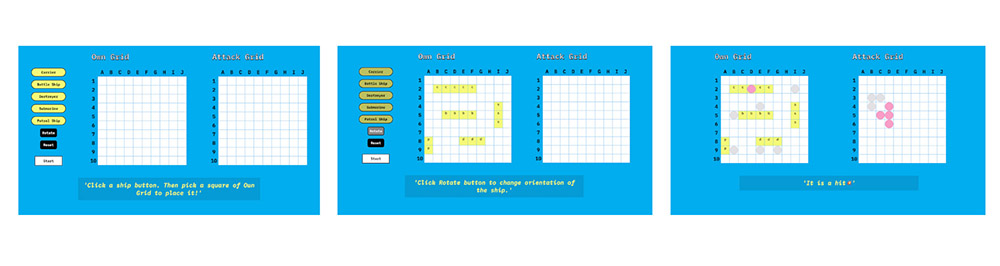
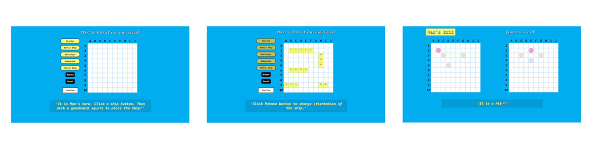

# odin-battleship

## The Odin Project: Battleship 

 
  

      
  

 

This project is a desktop browser-based Battleship game, developed to enhance my understanding of Test Driven Development (TDD). For more details on this project, please visit [The Odin Project - Project: Battleship](https://www.theodinproject.com/lessons/node-path-javascript-battleship).

## Key Project Instructions

Develop the application with the following specifications:

**Test Driven Development (TDD):**  
Follow TDD principles by writing one test at a time and implementing the following classes or factories:

1. `Ship` (object) contains:

-   length - The length of the ship

-   hit() - Records hits to the ship

-   isSunk() - Checks if the ship is sunk based on its length and the number of hits.

2. `Gameboard` (object) contains:

-   Functions that communicate with the Ship object and store the ship’s coordinates within the corresponding Ship object.

-   receiveAttack() - Processes attack coordinates and determines if it’s a hit or miss, updating the hit count for the corresponding Ship object.

-   Tracks missed coordinates.

-   A function to check if all ships are hit.

3. `Player` (object) contains:

-   Two player objects - One for the human player and one for the computer, each storing an individual Gameboard object.

**User Interface:**  
The browser displays both players’ gameboards, reflecting the current state of each Gameboard object.

**Game Management:**  
Use event listeners to control the game flow, utilizing the methods defined in the Ship, Gameboard, and Player objects. Any additional game logic should be encapsulated within one of these objects.

**Attack Mode:**  
When a player clicks on the opponent’s gameboard, the data is processed through the game’s methods, and the updated game state is reflected on the display.

**Turn Management:**  
Player turns are managed in a separate module, outside of the core game management objects.

**Computer Player:**  
The computer player selects random coordinates for its attacks, ensuring they are valid and not repeated.

**End Game:**  
The game ends when one player loses all their ships.

**Ship Placement:**  
Provide a system for the player to place ships on their gameboard.

#### Extra Credit

-   (Implemented) Develop a two-player version sharing one display, ensuring that players cannot see each other’s ship positions when it’s not their turn.

-   (Implemented) Enable the computer to attack neighboring positions after it recognizes a hit.

-   (Skipped) Implement drag-and-drop functionality for ship placement.

 
  

      
  

Two-Player version
 

## Built With

-   HTML
-   CSS
-   JavaScript
-   Jest
-   Babel (for Jest)
-   ESLint
-   Prettier

---

### Referenced Tutorials

JavaScript Related:

-   [From Impure to Pure Code by Tommi Kaikkonen](https://tommikaikkonen.github.io/impure-to-pure/)

-   [Pure vs Impure Functions in Functional Programming – What's the Difference? by freeCodeCamp](https://www.freecodecamp.org/news/pure-function-vs-impure-function/)

-   [Pure Functions / Intro to JavaScript ES6 programming, lesson 17 by Codexpanse](https://youtu.be/dZ41D6LDSBg?si=EvWVn0h6Tyt6VfOV)

-   [Overriding Properties in Spread syntax (...) by MDN](https://developer.mozilla.org/en-US/docs/Web/JavaScript/Reference/Operators/Spread_syntax)

-   [JavaScript Program to Merge Two Sets by geeksforgeeks](https://www.geeksforgeeks.org/javascript-program-to-merge-two-sets/)

-   [Deep Cloning Objects in JavaScript, the Modern Way by Builder.io](https://www.builder.io/blog/structured-clone)

-   [Functional JS #3: State by Krzysztof Czernek](https://medium.com/dailyjs/functional-js-3-state-89d8cc9ebc9e)

UI related:

-   [Radical ’80s Color Palettes by OFFEO](https://offeo.com/learn/80s-color-palette#toc-neutral-colors)

Jest related:

-   [Help with writing mocha/jest test for the deep copy function (inheritance) by sitepoint community](https://www.sitepoint.com/community/t/help-with-writing-mocha-jest-test-for-the-deep-copy-function-inheritance/363310)
